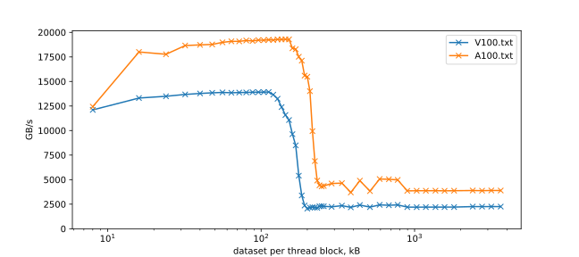
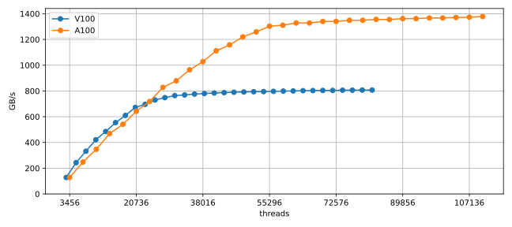

# cuda-roofline

Short CUDA code that scans a range of Computational Intensities, by varying the amount of inner loop trips. The shell script series.sh builds an executable for each value, and executes them one afer another after finishing building.

The Code runs simultaneously on all available devices. Example output on four Tesla V100 PCIe 16GB:

```console
1 640 blocks     0 its      0.125 Fl/B        869 GB/s       109 GF/s   1380 Mhz   138 W   60°C
2 640 blocks     0 its      0.125 Fl/B        869 GB/s       109 GF/s   1380 Mhz   137 W   59°C
3 640 blocks     0 its      0.125 Fl/B        869 GB/s       109 GF/s   1380 Mhz   124 W   56°C
0 640 blocks     0 its      0.125 Fl/B        869 GB/s       109 GF/s   1380 Mhz   124 W   54°C

1 640 blocks     8 its      1.125 Fl/B        861 GB/s       968 GF/s   1380 Mhz   159 W   63°C
0 640 blocks     8 its      1.125 Fl/B        861 GB/s       968 GF/s   1380 Mhz   142 W   56°C
2 640 blocks     8 its      1.125 Fl/B        861 GB/s       968 GF/s   1380 Mhz   157 W   62°C
3 640 blocks     8 its      1.125 Fl/B        861 GB/s       968 GF/s   1380 Mhz   144 W   59°C

[...]

3 640 blocks    56 its      7.125 Fl/B        841 GB/s      5990 GF/s   1380 Mhz   227 W   66°C
1 640 blocks    56 its      7.125 Fl/B        841 GB/s      5990 GF/s   1372 Mhz   249 W   71°C
2 640 blocks    56 its      7.125 Fl/B        841 GB/s      5990 GF/s   1380 Mhz   235 W   69°C
0 640 blocks    56 its      7.125 Fl/B        841 GB/s      5990 GF/s   1380 Mhz   220 W   62°C

0 640 blocks    64 its      8.125 Fl/B        811 GB/s      6587 GF/s   1380 Mhz   223 W   63°C
3 640 blocks    64 its      8.125 Fl/B        813 GB/s      6604 GF/s   1380 Mhz   230 W   66°C
1 640 blocks    64 its      8.125 Fl/B        812 GB/s      6595 GF/s   1380 Mhz   241 W   71°C
2 640 blocks    64 its      8.125 Fl/B        813 GB/s      6603 GF/s   1380 Mhz   243 W   69°C
```


# cuda-memcpy

Measures the host-to-device transfer rate of the cudaMemcpy function over a range of transfer sizes

Example output for a Tesla V100 PCIe 16GB
``` console
         1kB     0.03ms    0.03GB/s   0.68%
         2kB     0.03ms    0.06GB/s   5.69%
         4kB     0.03ms    0.12GB/s   8.97%
         8kB     0.03ms    0.24GB/s   6.25%
        16kB     0.04ms    0.44GB/s   5.16%
        32kB     0.04ms    0.93GB/s   2.70%
        64kB     0.04ms    1.77GB/s   5.16%
       128kB     0.04ms    3.46GB/s   7.55%
       256kB     0.05ms    5.27GB/s   1.92%
       512kB     0.07ms    7.53GB/s   1.03%
      1024kB     0.11ms    9.25GB/s   2.52%
      2048kB     0.20ms   10.50GB/s   1.07%
      4096kB     0.37ms   11.41GB/s   0.58%
      8192kB     0.71ms   11.86GB/s   0.44%
     16384kB     1.38ms   12.11GB/s   0.14%
     32768kB     2.74ms   12.23GB/s   0.03%
     65536kB     5.46ms   12.29GB/s   0.08%
    131072kB    10.89ms   12.32GB/s   0.02%
    262144kB    21.75ms   12.34GB/s   0.00%
    524288kB    43.47ms   12.35GB/s   0.00%
   1048576kB    86.91ms   12.35GB/s   0.00%
```

# um-stream

Measures CUDA Unified Memory transfer rate using a STREAM triad kernel. A range of data set sizes is used, both smaller and larger than the device memory. Example output on a Tesla V100 PCIe 16GB:

```console
 buffer size      time   spread   bandwidth
       24 MB     0.1ms     3.2%   426.2GB/s
       48 MB     0.1ms    24.2%   511.6GB/s
       96 MB     0.1ms     0.8%   688.0GB/s
      192 MB     0.3ms     1.8%   700.0GB/s
      384 MB     0.5ms     0.5%   764.6GB/s
      768 MB     1.0ms     0.2%   801.8GB/s
     1536 MB     2.0ms     0.0%   816.9GB/s
     3072 MB     3.9ms     0.1%   822.9GB/s
     6144 MB     7.8ms     0.2%   823.8GB/s
    12288 MB    15.7ms     0.1%   822.1GB/s
    24576 MB  5108.3ms     0.5%     5.0GB/s
    49152 MB 10284.7ms     0.8%     5.0GB/s
```


# cuda-cache

Measures bandwidths of different cache levels. Launches one thread block per SM. Each thread block reads the contents of the same buffer. Varying buffer sizes changes the targeted cache level. Example output on a Tesla V100 PCIe 32GB:


``` console
     data set   exec time     spread        Eff. bw        meas. L2 Read      meas. Tex Read
         8 kB        11ms       1.7%   12087.2 GB/s             0.1 GB/s        12274.3 GB/s
        24 kB         9ms       0.1%   13491.1 GB/s             0.2 GB/s        13494.8 GB/s
        32 kB         9ms       0.0%   13679.2 GB/s             0.3 GB/s        13419.6 GB/s
        48 kB         9ms       0.2%   13744.4 GB/s             0.4 GB/s        13753.4 GB/s
        56 kB         9ms       0.1%   13794.8 GB/s             0.5 GB/s        13797.1 GB/s
        72 kB         9ms       0.1%   13855.9 GB/s             0.6 GB/s        13854.0 GB/s
        88 kB         9ms       0.2%   13867.6 GB/s             0.8 GB/s        13870.8 GB/s
       104 kB         9ms       0.0%   13895.6 GB/s             0.9 GB/s        13896.1 GB/s
       112 kB         9ms       0.1%   13896.8 GB/s             1.0 GB/s        13882.9 GB/s
       128 kB        10ms       4.0%   13243.0 GB/s          1040.5 GB/s        13484.1 GB/s
       136 kB        10ms      10.7%   12444.5 GB/s          1462.3 GB/s        13159.4 GB/s
       152 kB        12ms      10.1%   10953.1 GB/s           744.2 GB/s        11212.3 GB/s
       168 kB        15ms      33.5%    8634.4 GB/s          1181.1 GB/s         8730.1 GB/s
       184 kB        39ms     103.2%    3287.4 GB/s          1130.6 GB/s         6258.3 GB/s
       192 kB        55ms      34.1%    2326.8 GB/s          2060.4 GB/s         2230.4 GB/s
       216 kB        58ms       1.9%    2188.4 GB/s          2191.4 GB/s         2195.4 GB/s
       232 kB        60ms       9.2%    2133.6 GB/s          2101.5 GB/s         2094.3 GB/s
       256 kB        56ms       1.7%    2286.0 GB/s          2479.5 GB/s         2477.4 GB/s
       384 kB        59ms       2.8%    2178.7 GB/s          2224.9 GB/s         2224.9 GB/s
       592 kB        53ms       4.9%    2427.8 GB/s          2377.0 GB/s         2383.8 GB/s
       680 kB        54ms       7.0%    2388.2 GB/s          2480.7 GB/s         2483.8 GB/s
      1032 kB        58ms       1.7%    2196.4 GB/s          2218.4 GB/s         2217.6 GB/s
      1368 kB        58ms       0.5%    2201.8 GB/s          2200.2 GB/s         2200.5 GB/s
      3640 kB        57ms       0.1%    2253.3 GB/s          2254.5 GB/s         2251.3 GB/s

```

NVIDIA A100-SXM4-40GB

``` console
     data set   exec time     spread        Eff. bw
        8 kB        14ms       2.6%   12577.1 GB/s
        24 kB        10ms       3.7%   17667.1 GB/s
        48 kB         9ms       0.8%   18770.0 GB/s
        64 kB         9ms       0.1%   19090.8 GB/s
        72 kB         9ms       0.5%   19100.9 GB/s
        80 kB         9ms       0.1%   19174.4 GB/s
       104 kB         9ms       0.4%   19206.1 GB/s
       120 kB         9ms       0.6%   19218.7 GB/s
       144 kB         9ms       0.0%   19293.1 GB/s
       152 kB         9ms       0.2%   19294.0 GB/s
       168 kB         9ms       4.3%   18318.8 GB/s
       184 kB        10ms       9.0%   17206.7 GB/s
       192 kB        11ms       6.5%   15680.9 GB/s
       216 kB        18ms      67.7%    9680.0 GB/s
       224 kB        25ms      72.0%    6847.9 GB/s
       248 kB        40ms       4.7%    4317.2 GB/s
       384 kB        47ms       2.4%    3694.1 GB/s
       512 kB        45ms       1.6%    3834.3 GB/s
       592 kB        34ms       1.6%    5063.1 GB/s
       680 kB        34ms       0.8%    5036.9 GB/s
       896 kB        45ms       0.4%    3857.0 GB/s
      1368 kB        45ms       0.3%    3875.7 GB/s
      2392 kB        44ms       0.1%    3892.4 GB/s
      3640 kB        44ms       0.1%    3890.8 GB/s
```





# cuda-stream

Measures the bandwidth of streaming kernels for varying occupancy. A shared memory allocation serves as a spoiler, so that only two thread blocks can run per SM. Scanning the thread block size from 32 to 1024 scans the occupancy from 3% to 100%.


Kernel | Formula |   |
-------|----------|---|
init  | A[i] = c  |   1 store stream
read | sum = A[i] |   1 load stream
scale | A[i] = B[i] * c |   1 load stream, 1 store stream
triad | A[i] = B[i] + c * C[i] |  2 load streams, 1 store stream
3pt | A[i] = B[i-1] + B[i] + B[i+1] |  1 load streams, 1 store stream
5pt | A[i] = B[i-2] + B[i-1] + B[i] + B[i+1] + B[i+2] |  1 load streams, 1 store stream


Results from a NVIDIA A100-SXM4-40GB / CUDA 11.6
``` console
blockSize   threads       %occ  |                init       read       scale     triad       1pt       3pt
       32        3456      3 %  |  GB/s:         163         68        128        179        121        118
       64        6912    6.2 %  |  GB/s:         323        133        248        345        229        225
       96       10368    9.4 %  |  GB/s:         477        194        347        481        330        324
      128       13824   12.5 %  |  GB/s:         628        257        469        643        431        423
      160       17280   15.6 %  |  GB/s:         766        313        541        738        516        504
      192       20736   18.8 %  |  GB/s:         908        372        642        873        605        590
      224       24192   21.9 %  |  GB/s:        1041        427        718        970        688        669
      256       27648   25.0 %  |  GB/s:        1170        492        828       1100        773        752
      288       31104   28.1 %  |  GB/s:        1299        537        879       1164        840        816
      320       34560   31.2 %  |  GB/s:        1412        593        964       1253        920        894
      352       38016   34.4 %  |  GB/s:        1501        642       1028       1298        986        957
      384       41472   37.5 %  |  GB/s:        1501        699       1112       1333       1056       1022
      416       44928   40.6 %  |  GB/s:        1502        741       1158       1334       1107       1064
      448       48384   43.8 %  |  GB/s:        1501        792       1220       1350       1168       1128
      480       51840   46.9 %  |  GB/s:        1502        834       1259       1349       1212       1177
      512       55296   50.0 %  |  GB/s:        1503        898       1303       1359       1254       1222
      544       58752   53.1 %  |  GB/s:        1501        917       1310       1359       1282       1248
      576       62208   56.2 %  |  GB/s:        1502        960       1328       1367       1310       1284
      608       65664   59.4 %  |  GB/s:        1502       1000       1329       1368       1316       1301
      640       69120   62.5 %  |  GB/s:        1503       1046       1341       1375       1324       1313
      672       72576   65.6 %  |  GB/s:        1502       1073       1339       1375       1329       1320
      704       76032   68.8 %  |  GB/s:        1502       1113       1349       1381       1337       1328
      736       79488   71.9 %  |  GB/s:        1502       1143       1348       1382       1339       1332
      768       82944   75.0 %  |  GB/s:        1502       1184       1356       1387       1343       1335
      800       86400   78.1 %  |  GB/s:        1501       1201       1355       1388       1346       1338
      832       89856   81.2 %  |  GB/s:        1503       1234       1361       1392       1351       1343
      864       93312   84.4 %  |  GB/s:        1502       1258       1362       1394       1353       1344
      896       96768   87.5 %  |  GB/s:        1501       1288       1367       1395       1355       1346
      928      100224   90.6 %  |  GB/s:        1500       1306       1367       1395       1358       1350
      960      103680   93.8 %  |  GB/s:        1502       1332       1372       1396       1361       1353
      992      107136   96.9 %  |  GB/s:        1501       1350       1372       1396       1363       1355
     1024      110592  100.0 %  |  GB/s:        1502       1387       1378       1394       1366       1358

```



# cuda-latency

Pointer chasing benchmark for latency measurement. A single warp fully traverses a buffer in random order. A partitioning scheme is used to ensure that all cache lines are hit exactly once before they are accessed again. Latency in clock cycles is computed with the current clock rate.

Example results for a Tesla-V100-PCIe-16GB
``` console
  MHz       kB       ms   cycles
 1380        0      2.9    30.0
 1380        0      2.8    30.0
 1380        1      2.8    30.0
 1380        2      2.8    30.0
 1380        4      2.9    30.0
 1380        8      2.9    30.1
 1380       16      2.9    30.3
 1380       32      2.9    30.7
 1380       64      3.0    31.4
 1380      128      7.4    78.3
 1380      256     20.4   214.4
 1380      512     20.4   214.4
 1380     1024     20.4   214.4
 1380     2048     20.4   214.4
 1380     4096     20.4   214.4
 1380     8192     40.6   428.0
 1380    16384     81.3   427.9
 1380    32768    162.6   428.0
 1380    65536    328.5   432.3
 1380   131072    660.2   434.4
 1380   262144   1323.5   435.5
 1380   524288   2650.5   436.0
```


Both the L1 cache (128kB) and the L2 cache(6MB) are clearly visible

# cuda-incore

Measures the latency and throughput of FMA, DIV and SQRT operation. It scans combinations of ILP=1..8, by generating 1..8 independent dependency chains, and TLP, by varying the warp count on a SM from 1 to 32. The final output is a ILP/TLP table, with the reciprocal throughputs (cycles per operation):

Example output on a Tesla V100 PCIe 16GB:

``` console
DFMA
  8.67   4.63   4.57   4.66   4.63   4.72   4.79   4.97
  4.29   2.32   2.29   2.33   2.32   2.36   2.39   2.48
  2.14   1.16   1.14   1.17   1.16   1.18   1.20   1.24
  1.08   1.05   1.05   1.08   1.08   1.10   1.12   1.14
  1.03   1.04   1.04   1.08   1.07   1.10   1.11   1.14
  1.03   1.04   1.04   1.08   1.07   1.10   1.10   1.14

DDIV
111.55 111.53 111.53 111.53 111.53 668.46 779.75 891.05
 55.76  55.77  55.76  55.76  55.76 334.26 389.86 445.51
 27.88  27.88  27.88  27.88  27.88 167.12 194.96 222.82
 14.11  14.11  14.11  14.11  14.11  84.77  98.89 113.00
  8.48   8.48   8.48   8.48   8.48  50.89  59.36  67.84
  7.51   7.51   7.51   7.51   7.51  44.98  52.48  59.97

DSQRT
101.26 101.26 101.26 101.26 101.26 612.76 714.79 816.83
 50.63  50.62  50.63  50.63  50.62 306.36 357.38 408.40
 25.31  25.31  25.31  25.31  25.31 153.18 178.68 204.19
 13.56  13.56  13.56  13.56  13.56  82.75  96.83 110.29
  9.80   9.80   9.80   9.80   9.80  60.47  70.54  80.62
  9.61   9.61   9.61   9.61   9.61  58.91  68.72  78.53
```

Some Features can be extracted from the plot.

Latencies:
 - DFMA: 8 cycles
 - DDIV: 112 cycles
 - DSQRT: 101 cycles
 
Throughput of one warp (runs on one SM quadrant), no dependencies:
 - DFMA: 1/4 per cycle (ILP 2, to ops overlap)
 - DDIV: 1/112 per cycle (no ILP/overlap)
 - DSQRT: 1/101 per cycle (no ILP/overlap)
  
Throughput of multiple warps (all SM quadrants), dependencies irrelevant:
 - DFMA: 1 per cycle 
 - DDIV: 1/7.5 cycles
 - DSQRT: 1/9.6 cycles
 


