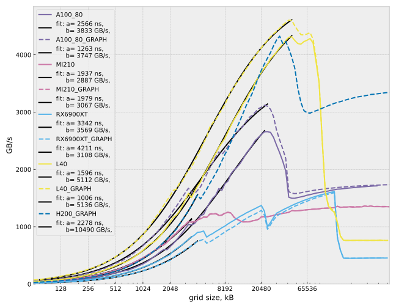

# Repeated Small Kernel Performance

This benchmark explors the potential for cache blocking, where kernels work on a small data set that fits into caches. Because the data set is small, and the L2 cache is fast, the kernel executues so quickly that the startup overhead of a kernel launch becomes dominant. The benchmark queues 10000 calls of a streaming SCALE kernel of varying size. Use commandline option "-graph" to use the cudaGraph/hipGraph API. 

Each device gets a fit of \$a,b\$ for the function

$$T = \frac{V}{a + V/b}$$

which models the performance with a startup overhead \$a\$ and a bandwidth \$b\$ depending on the data volume \$V\$. 
